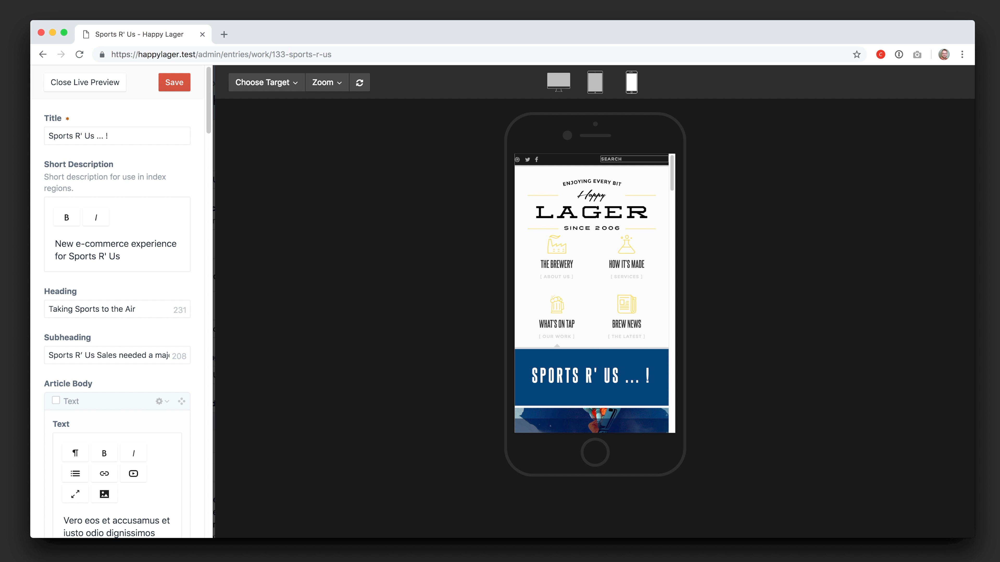

[](https://scrutinizer-ci.com/g/angell-co/Portal/?branch=master) [](https://scrutinizer-ci.com/g/angell-co/Portal/build-status/master) [](https://scrutinizer-ci.com/code-intelligence)

# Portal

Portal brings advanced Live Preview capabilities to Craft CMS.


Preview your content on tablet & mobile in the device emulator and add additional target templates for users to switch to, all within the primary Live Preview window.



Check out the [introductory video](https://youtu.be/BWXoswTiUGk).

**Available in the plugin store for $29.**


## Requirements

This plugin requires Craft CMS 3.0.15 or later.

## Installation

To install the plugin, follow these instructions.

1. Open your terminal and go to your Craft project:

        cd /path/to/project

2. Then tell Composer to load the plugin:

        composer require angellco/portal

3. In the Control Panel, go to Settings → Plugins and click the “Install” button for Portal.


## Usage

There are two parts to Portal right now and both affect Live Preview. 


### Device Emulator

The device emulator is a tool that lets your users preview their content as it will look on different device screens, for simplicity there are only three options: Desktop, Tablet and Mobile. It looks like this:


You can switch between devices, change the orientation and also the zoom level.

If you wish to disable this feature then add the following to `config/portal.php`:

```php
<?php

return [
    'showLivePreviewDeviceEmulator' => true
];
```

### Targets

Targets are alternative templates that you want to make available to Live Preview, you can add them by going to the Portal tab in the main navigation.

If you have multiple Sites then you can load different templates for each Site, as well as restrict a Target to either a Section, Category Group or Product Type.

Once you have a Target added you will see a select input appear in the Live Preview window allowing your users to efficiently preview their content across multiple templates.


---

Brought to you by [Angell & Co](https://angell.io)
